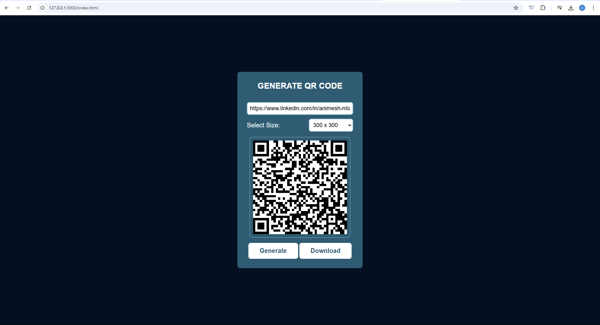

# QR Code Generator

A simple web application to generate and download QR codes from text or URLs.

## Features
- Convert text/URLs to QR codes instantly
- Customize QR code size (100x100 to 1000x1000 pixels)
- Download QR codes as PNG images
- Mobile-responsive design
- Clean, modern interface

## Screenshots 📸

## Technical Requirements
- Modern web browser
- Internet connection (for CDN libraries)
- JavaScript enabled

## Installation
1. Download all project files.
2. Ensure you have the following files:
   - `index.html`
   - `style.css`
   - `script.js`
3. No additional installation is needed - runs directly in your browser.

## Usage
1. Open `index.html` in your web browser.
2. Type or paste your text or URL in the input field.
3. Select the desired QR code size from the dropdown.
4. Click the "Generate QR Code" button.
5. Click "Download" to save the QR code as a PNG image.

## Project Structure
- `index.html`: Main HTML document containing the structure and elements.
- `style.css`: Stylesheet for layout and design.
- `script.js`: JavaScript file managing QR code generation and download functionality.
- `README.txt`: This documentation file.

## Contributing
1. Fork this repository.
2. Create a feature branch.
3. Submit a pull request with your changes.

## License
This project is licensed under the MIT License.

## Contact
For bugs, feature requests, or contributions, please reach out via GitHub.

---

**Version:** 1.0  
**Created:** 2024
